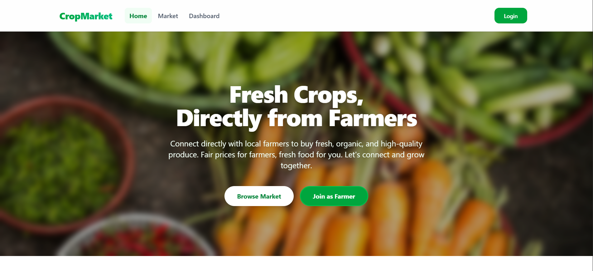
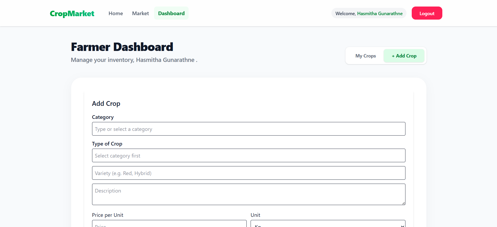
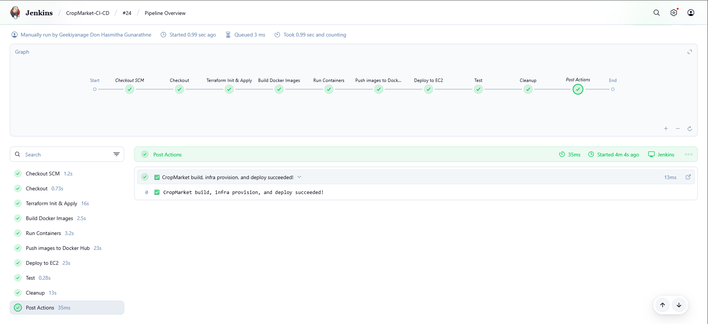
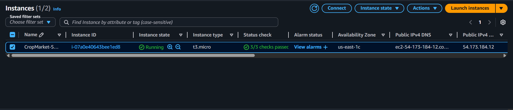

# Crop Market 🌾

Crop Market is a modern, full-stack web application designed to connect farmers and buyers in a seamless digital marketplace. This platform provides an intuitive interface for users to browse, list, and trade agricultural products. Built with scalability and automated deployments in mind, the application features a robust CI/CD pipeline and cloud infrastructure provisioning.

## 🚀 Key Features
- **User Authentication:** Secure login and registration using JWT and bcrypt.
- **Crop Listings:** Browse and manage crop listings in real-time.
- **Responsive Design:** A fully responsive and aesthetic user interface built with Tailwind CSS.
- **Automated Deployments:** A continuous integration and deployment pipeline using Jenkins.
- **Infrastructure as Code:** Automated cloud infrastructure setup using Terraform on AWS.

## 🛠️ Tech Stack
This project leverages the **MERN** stack along with modern DevOps tools.

### Frontend
- **React 19 & Vite:** For building a fast, dynamic user interface.
- **Tailwind CSS:** For sleek, responsive styling.
- **Axios & React Router:** For API communication and seamless navigation.

### Backend
- **Node.js & Express.js:** Robust server-side framework for handling RESTful APIs.
- **MongoDB & Mongoose:** NoSQL database for flexible data storage.
- **JWT & bcryptjs:** For secure user authentication and data protection.

### DevOps & Infrastructure
- **Docker & Docker Compose:** For containerizing the application and managing multi-container deployments.
- **Jenkins:** For automated CI/CD pipelines.
- **Terraform:** For provisioning Infrastructure as Code (IaC) on AWS.
- **AWS (EC2):** For cloud hosting and scalable deployments.

---

## 📸 Screenshots & Architecture


### 🖥️ Frontend Preview
*The frontend provides a clean, responsive, and intuitive user interface for users to interact with the Crop Market.*




### ⚙️ CI/CD Pipeline
*Our automated Jenkins pipeline handles the building, testing, and deployment of the application seamlessly.*



### ☁️ AWS Deployment (EC2)
*The application and its containers are hosted on AWS EC2 instances, provisioned automatically using Terraform.*



---

## 🚦 Running the Application Locally

1. **Clone the repository:**
   ```bash
   git clone <your-repo-url>
   cd CropMarket
   ```

2. **Start with Docker Compose:**
   ```bash
   docker-compose up --build
   ```
   This will spin up the backend and frontend services.
